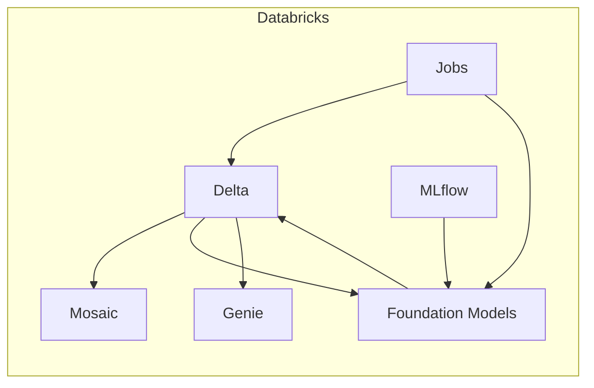

# Technical explanation script — Healthmap Agent (Databricks)

**Format:** one **~2 minute** voiceover.  
**Stack (only):** **Databricks** — **Delta**, **Mosaic AI Vector Search**, **Agent Bricks / Foundation Models**, **MLflow**, **Jobs**, **Genie**.

**Pacing:** about **130–150 words per minute** on camera (clear, judge-friendly). The main block is **~275 words** (roughly **1:50–2:10**; trim optional sentence if you must land exactly two minutes). If you run long, cut the single sentence marked **[CUT if over time]** in paragraph 3.

**Deeper reference (not for the video):** `docs/DATABRICKS_RUNBOOK.md`.

---

## 2-minute read-aloud (full video)

Read straight through.

> “Healthmap Agent is a trust-aware healthcare intelligence system on Databricks. It answers where to find care in India—think rural Bihar, emergency surgery—with evidence behind each result, not a black-box chat.
>
> “Data starts as Excel, then notebook one ingests into Delta—`facilities_raw` and `facilities_clean`—in Unity Catalog so the dataset is versioned and governs access consistently. Notebooks two and two-b enrich the lake: a zero-dollar regex path for tristate capabilities, trust, and medical deserts, or when you need higher recall, Agent Bricks and Databricks Foundation Models that materialize a dedicated LLM capability table. Trust scores and desert marts sit next to facilities in the same schema for downstream SQL and Genie.
>
> “Notebook four builds Mosaic AI Vector Search so retrieval is semantic, but we still filter on Delta columns for state, rurality, and structured facts. Notebook three is the MLflow demo with step-by-step traces. Notebook five turns deserts into map-ready impact; notebook six wires Genie so stakeholders query those curated tables in natural language. Databricks Jobs automate the pipeline when new data lands. [CUT if over time: Store Tavily and model credentials in Databricks secret scopes.]
>
> “Each user question is a short pipeline: understand the ask, search Mosaic with structured filters, read capabilities from Delta or call a Foundation Model when a row is missing, validate with rules and optional web standards, trust-score, then rank by blending match and trust, and return brief explainable lines. That is transparent, cost-aware healthcare intelligence on one platform—not a one-off RAG demo. One lakehouse story: Delta for truth, Mosaic for search, Foundation Models for deep extraction, MLflow for auditability, Genie and Jobs for who touches the data and when. Full notebook order is in `docs/DATABRICKS_RUNBOOK.md`.”

---

## If you need ~90 seconds (trimmed)

> “Healthmap on Databricks ingests the India facilities Excel into Delta, enriches with regex or Foundation Models and Agent Bricks, adds trust and medical deserts, then Mosaic AI Vector Search for semantic retrieval with Delta filters, MLflow traces in notebook three, crisis maps, Genie, and Jobs to automate. Each query: understand, retrieve, validate, trust-rank, explain. Delta, Mosaic, Foundation Models, MLflow, Genie, Jobs—one stack. See the Databricks runbook for details.”

**Word count (trimmed):** ~80 words — speak slightly slower or add 10 seconds of B-roll.

---

# Appendix (slides / description field — not voiceover)

| Order | Focus |
|------|--------|
| 0–1 | Setup, Excel → Delta |
| 2 / 2b | Regex or LLM capabilities, trust, deserts |
| 3 | Query + MLflow |
| 4 | Mosaic |
| 5 | Crisis map |
| 6 | Genie + prompts |

## Mermaid (optional end card)

---

*Healthmap Agent (Databricks) — "Serving A Nation" context. Tweak catalog, endpoints, and widgets to your workspace.*
